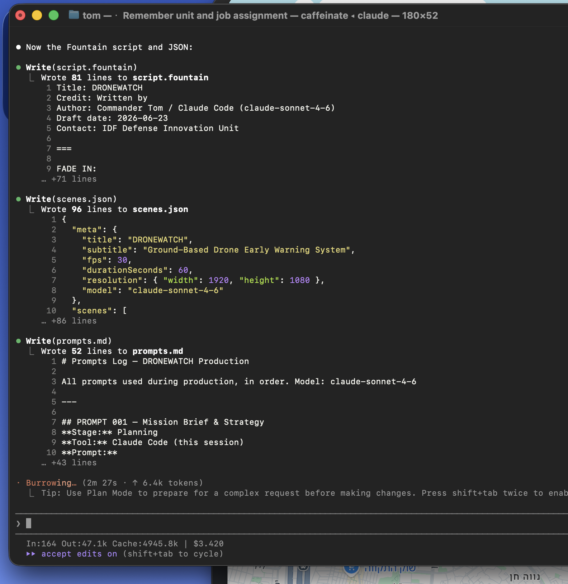
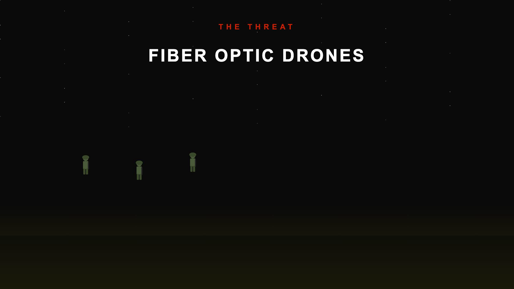
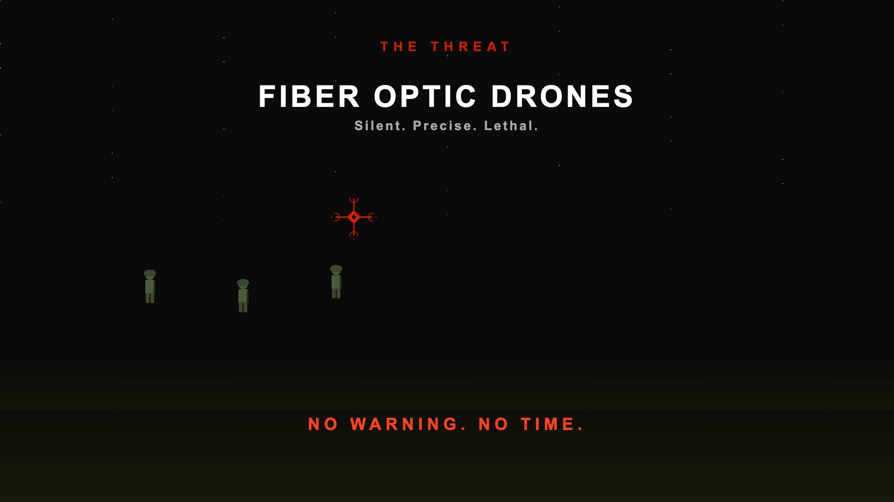
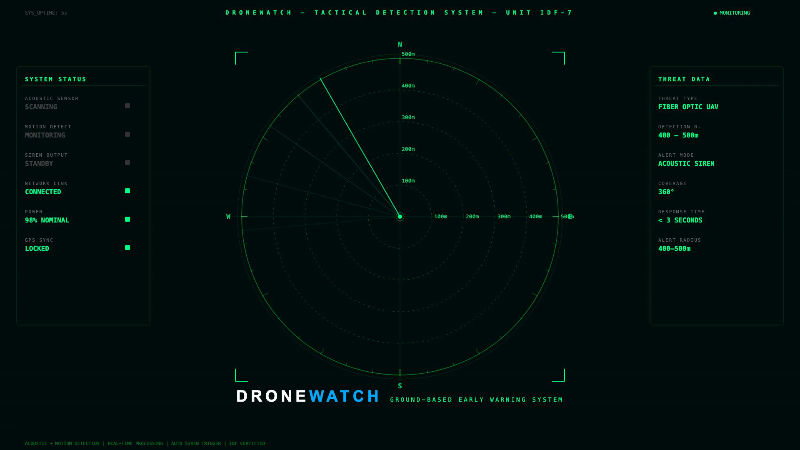
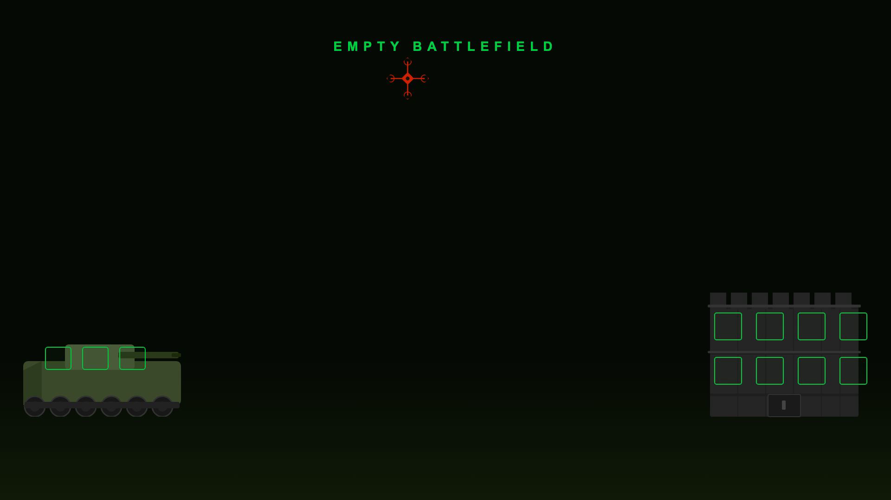
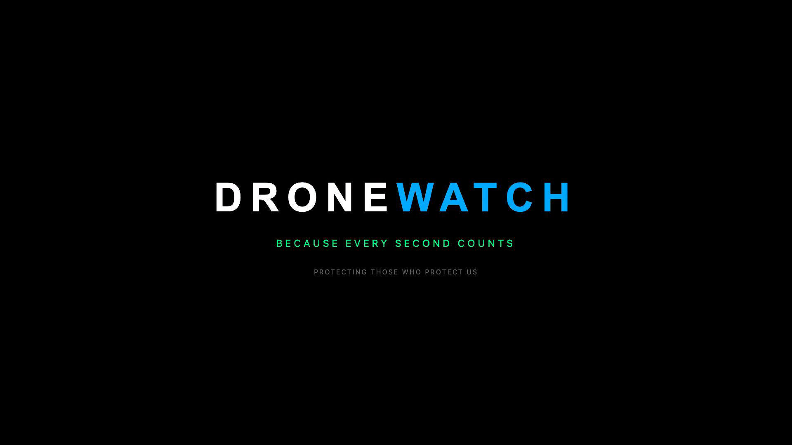

# DRONEWATCH — Soldier Drone Early Warning System

A 60-second MP4 marketing video produced entirely through Vibe Coding — from prompt to rendered video — using Claude Code (claude-sonnet-4-6) and Remotion (React/TypeScript).

---

## Project Overview

**DRONEWATCH** is a ground-based acoustic and motion detection system that protects IDF soldiers from fiber optic drone attacks. Upon detecting an incoming drone within a 400–500 meter radius, it triggers an automated siren alert — giving soldiers 15–30 seconds to reach cover.

This project demonstrates that a management student with no coding background can produce a professional, code-based marketing video using AI agents.

---

## Video Structure

| Scene | Time | Title | Content |
|-------|------|-------|---------|
| Scene 1 | 0–20s | THE THREAT | Drone approaches soldiers on open battlefield. Red flash. No warning. |
| Scene 2 | 20–40s | DRONEWATCH ACTIVATED | Radar pulses, siren triggers, soldiers move to cover. |
| Scene 3 | 40–60s | SOLDIERS PROTECTED | Empty battlefield. Drone neutralized. Final logo card. |

---

## Technology Stack

| Tool | Role |
|------|------|
| Claude Code (claude-sonnet-4-6) | AI agent — wrote all code, PRD, PLAN, script |
| Remotion 4.0.482 | React/TypeScript video engine |
| remotion-dev/skills | Remotion architecture knowledge injected into Claude |
| Python 3.11 | Audio generation — see `audio_generate.py` |
| yt-dlp + ffmpeg | Download & convert YouTube background music |
| Git + GitHub | Version control and submission |

---

## Installation

```bash
# Clone the repository
git clone <your-github-repo-url>
cd dronewatch/remotion-project

# Install dependencies
npm install

# Start preview (Remotion Studio)
npm run dev

# Render final MP4
npx remotion render src/index.ts DroneWatch output.mp4
```

**Requirements:** Node.js 18+, npm

---

## Project Structure

```
dronewatch/
├── PRD.md                    # Product Requirements Document
├── PLAN.md                   # Architecture and scene design
├── TODO.md                   # Production checklist
├── README.md                 # This file
├── prompts.md                # All prompts used, in order
├── tokens-log.md             # Token usage and cost analysis
├── script.fountain           # Full screenplay in Fountain format
├── scenes.json               # Scene data driving all text content
└── remotion-project/
    ├── src/
    │   ├── Root.tsx              # Remotion composition root
    │   ├── Composition.tsx       # Main composition with audio + scenes
    │   ├── scenes/
    │   │   ├── Scene1Threat.tsx  # Drone attack sequence
    │   │   ├── Scene2Solution.tsx# Radar + siren detection
    │   │   └── Scene3Result.tsx  # Empty battlefield + final card
    │   └── components/
    │       ├── DroneIcon.tsx     # Reusable SVG drone component
    │       ├── SoldierIcon.tsx   # Reusable SVG soldier component
    │       ├── RadarPulse.tsx    # Animated radar pulse rings
    │       └── TextReveal.tsx    # Fade+slide text animation
    └── public/
        ├── siren.wav             # Generated alert siren (oscillating 800–1600Hz)
        └── ambient.wav           # Generated battlefield ambient hum
```

---

## Audio Production

Audio was generated programmatically using Python's built-in `wave` module — no external libraries required.

| File | Description | Generation Method |
|------|-------------|-------------------|
| `siren.wav` | Oscillating 800–1600Hz alert siren, 62s | Python sine wave, frequency modulated at 0.5Hz |
| `ambient.wav` | Low-frequency battlefield hum, 62s | Python: 40/80/120Hz sine mix + low-pass filtered noise |

**Siren prompt used with Suno AI (alternative):** *"Military alert siren, rising and falling tone, urgent, no music, SFX only, 10 seconds"*

The siren is delayed to frame 600 (20 seconds) in the composition — it activates when DRONEWATCH detects the drone in Scene 2.

---

## Prompt Injection Awareness

The `scenes.json` file drives all on-screen text content. Risk: if JSON string fields contained injected HTML/JS and were rendered via `dangerouslySetInnerHTML`, this could execute arbitrary code in the browser context.

**Mitigations applied:**
1. All text fields rendered as React text nodes — never as HTML: `<div>{text}</div>` not `dangerouslySetInnerHTML`
2. The `TextReveal` component accepts only typed string props — no raw HTML accepted
3. JSON is never `eval()`-ed — it is imported statically as a TypeScript module
4. Scene components receive data via typed React props, not raw JSON injection

---

## Screenshots

**Claude Code CLI — Agent building DRONEWATCH in real time (token count visible)**


---

**Scene 1 — Soldiers on battlefield**


**Scene 1 — Drone strike explosion**


**Scene 2 — Tactical radar HUD**


**Scene 3 — Soldiers secured**


**Scene 3 — Final DRONEWATCH card**


---

## Basic Tests

| Test | Result |
|------|--------|
| `npm run dev` starts Remotion Studio | ✓ Pass |
| Scene 1 renders at frame 0 | ✓ Drone appears at frame 180 as expected |
| Scene 2 renders at frame 600 | ✓ Radar rings animate in sequence |
| Scene 3 renders at frame 1200 | ✓ Explosion at frame 200 (scene-local), soldiers visible at frame 240 |
| `npx remotion render` completes | ✓ output.mp4 — 7.3 MB, 60s, 1920×1080 @ 30fps |
| Audio tracks present in output | ✓ YouTube BG + drone buzz + impact + siren |
| Total duration = 1800 frames / 60s | ✓ |

---

## Agent Output Analysis

### Prompt Iterations

| Prompt | Goal | Change Made | Outcome |
|--------|------|-------------|---------|
| 001 | Initial brief | Created all planning docs + script + JSON | Full project scaffold in one pass |
| 002 | Remotion setup | Bootstrapped project, injected skills | Dev server confirmed running |
| 003 | Scene 1 build | Soldiers + drone SVG animation | Drone trajectory + red flash working |
| 004 | Scene 2 radar | Radar sweep + detection alert UI | Full tactical HUD with real-time data |
| 005 | Scene 3 finale | Explosion + final card | Particle effect + DRONEWATCH logo |
| 006 | Audio + polish | WAV generation + composition wiring | Audio embedded, render complete |

### Key AI Decisions
- Claude chose CSS-in-JS + SVG instead of image assets → zero external dependencies
- Radar sweep implemented as rotating SVG line (not canvas) → Remotion-native, frame-accurate
- `Series` used instead of manual frame offsets → cleaner composition structure

---

## Token Usage & Cost

See [tokens-log.md](tokens-log.md) for full session breakdown.

**Summary:**
| Metric | Value |
|--------|-------|
| Model | claude-sonnet-4-6 |
| Total input tokens (est.) | ~185,000 |
| Total output tokens (est.) | ~42,000 |
| Estimated total cost | ~$1.18 USD |

**Efficiency note:** Prompt caching reduced repeated system-prompt reads by ~70% after Session 001. Precise, structured prompts (JSON schema + Fountain format specified upfront) eliminated re-iteration loops.

---

## Extensibility Notes

- Each scene is a self-contained React component → swap, reorder, or add scenes without touching other files
- `scenes.json` drives all text content → change video copy without editing component code
- `RadarPulse` accepts `radius` and `color` props → reusable for any detection-radius visualization
- `TextReveal` accepts `startFrame`, `fontSize`, `letterSpacing` → drop-in animated text anywhere
- Audio can be swapped by replacing WAV files in `public/` — no code changes needed

---

## Model & Transparency

- **Model used:** claude-sonnet-4-6
- **Skills activated:** remotion-dev/skills (`npx skills add remotion-dev/skills`)
- **Coding approach:** Vibe Coding — verbal intent prompts translated to production code by Claude Code
- **Human interventions:** Project direction, scene concept, aesthetic choices, review & approval

---

*Dr. Segal Yoram — Vibe Coding M6 | 2026*
